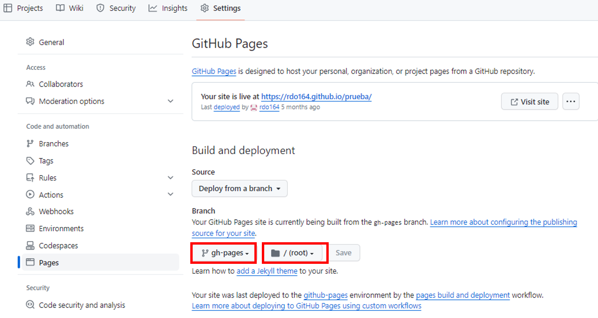

# mkDocs
MkDocs documentation. <br>
## Instalación:
```
pip install mkdocs
```
Te lo instala en el WORKON_HOME, sino en la ruta en la que esta en la línea de comandos.


## Crear tu archivo mkdocs:
```
     mkdocs new nombre del proyecto
```

> Automáticamente te genera una carpeta con el nombre del proyecto y dentro de ella un **archivo.yml** para la configuración y una **carpeta docs**, **AQUÍ** IRA LA **DOCUMENTACIÓN en .MD**. Además dentro de la carpeta docs te crea un index.md
<center>


</center>


## Runnea el servidor
```
    mkdocs serve
```

## Configuración de .yml

Se pueden añadir temas pero hay que **instalarlos**

Las dos **únicas opciones de configuración** son:
```
- site_name: PEPAS-API
- site_url: https://example.com/
```


## DESPLIEGUE DE LA PÁGINA WEB
> Github ofrece runners gratuitos por lo que no es necesario alojarlo. Los pasos son los siguientes:

1. Hacer uso del siguiente comando.
```
mkdocs gh-deploy 
```
Con este comando se ha creado una nueva rama en github, gh-pages, donde se van a almacena todos los archivos html necesarios para el despliegue.

2. Ir a github > Settings > Pages 



Se selecciona la rama gh-pages y la carpeta raíz, ya que contiene todos los archivos necesarios para crear la página web. 

Al poco rato nos aparecerá el link de nuestro sitio web desplegado con la url que muestra la imagen.

## CREAR EL CI

1. Crear la carpeta .github. 
2. Dentro de la carpeta crear workflows.

El organigrama debe ser tal que así: 
``` 
Carpeta padre/
              .git
              .github/ 
                      workflows/
                                XXXXXXXX.yml(encargado del CICD)
```
3. Configurar el XXXXXXXX.yml para que realice una serie de tareas cada vez que sucede un evento.

En este caso es para no tener que generar manualmente los archivos html. 
```
name: ci 
on:
  push:
    branches:
      - master 
      - main

permissions:
  contents: write

jobs:
  deploy:
    runs-on: ubuntu-latest
    steps:
      - uses: actions/checkout@v4
      
      - name: Configure Git Credentials
        run: |
          git config user.name github-actions[bot]
          git config user.email 41898282+github-actions[bot]@users.noreply.github.com

      - uses: actions/setup-python@v5
        with:
          python-version: 3.x

      - run: echo "cache_id=$(date --utc '+%V')" >> $GITHUB_ENV 

      - uses: actions/cache@v4
        with:
          key: mkdocs-material-${{ env.cache_id }}
          path: .cache
          restore-keys: |
            mkdocs-material-

      - run: pip install mkdocs-material 

      - name: Build and deploy MkDocs site
        run: mkdocs gh-deploy --force
        working-directory: primer-project

```


## CREAR ENTORNOS VIRTUALES CON VENWRAPPER
1. Instalar python
2. Instalar gestor de paquetes PIP
```
curl https://boootstrap.pypa.io/get-pip.py
```
3. Instalar **virtualenwrapper** (provee un entorno virtual dedicado a cada proyecto desarrollado con django)
```
pip install virtualenvwrapper-win
```
4. 
mkvirtualenv nombre_del_entorno 
